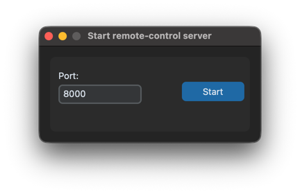
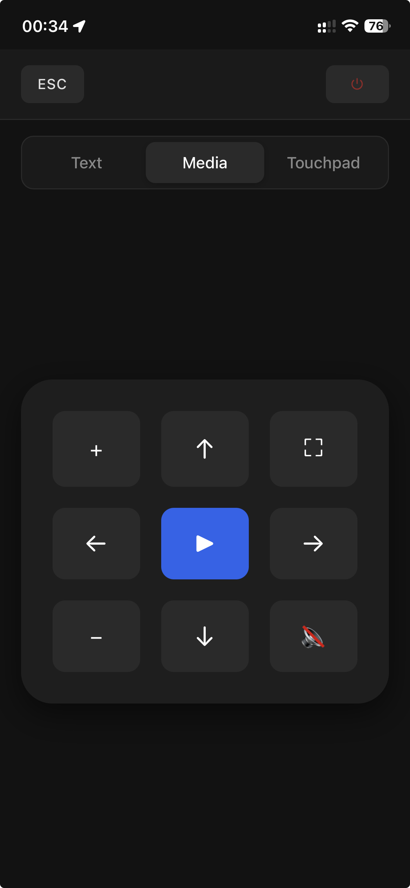

# PC Remote Control

A simple and convenient remote control for your computer.

---

## Features

* **Media Remote:** Control volume, play/pause, and skip tracks. Fully compatible with YouTube and most video streaming services.


* **Flask & Pynput Web API:** Simulates physical keystrokes on your PC via a lightweight backend.


* **Sleep Button:** Optimized to work across different operating systems—perfect for turning off your video before sleep without getting out of bed.


* **Reactive UI:** Powered by AJAX to ensure instant feedback and seamless control without annoying page reloads.

---

## Todo / Roadmap

* **UI/UX Improvements:**
  - Design a more intuitive and modern graphical user interface (UI).


* **Core Functionality:**
  - Add a clean way to stop the application (instead of manually killing the process).


* **New Remote Modes:**
  - **Touchpad Mode** for mouse cursor control.
  - **Text Input Mode** for convenient typing and searching, similar to a Smart TV experience.


---

## How to Run

### 1. Clone the repository

```bash
git clone https://github.com/hulchakk/py-remote.git
cd py-remote

```

### 2. Launch the app

*Note: You must have `uv` installed.*

```bash
uv run main.py

```

This command opens a local window where you can specify the port for your web server and hit the **Start** button to launch the main service.




### 3. Connect your device

You can now control your PC from a smartphone or any other device on the **same local network**. Simply open your browser and navigate to:

```
http://<your_pc_local_ip>:<port>/

```



---

## OS Specific Notes (For Pynput)

* **macOS:** You may need to grant Accessibility and Input Monitoring permissions to your terminal or IDE in *System Settings -> Privacy & Security*.
* **Linux:** Ensure your user has access to `/dev/input/` or is running under an X11 session (Wayland may require additional configuration or root privileges for global input simulation).
